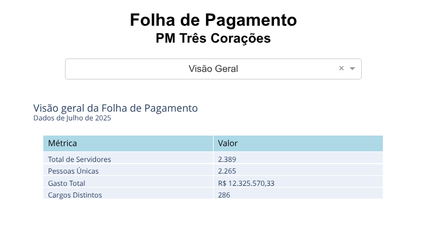

# Análise da folha de pagamento do município de Três Corações

Alguns anos atrás, utilizei [jq](https://rpubs.com/guilhermeferreirajf/pmtc) para analisar a folha de pagamento da Prefeitura Municipal de Três Corações,
município situado às margens da Fernão Dias, no Sul de Minas. Agora, reproduzimos a mesma rotina em Python.

### Coleta de dados

Para download dos dados, criamos uma função para baixar o arquivo XML, disponível no 
[Portal da Transparência](https://trescoracoes-mg.portaltp.com.br/api/transparencia.asmx/json_servidores),
salvo no formato JSON depois de processado. Poderá ser fornecida uma lista de períodos a serem baixados,
de acordo com o interesse do usuário, ao final do notebbok *baixar_fopag.ipynb*. 

```Python
import requests
import re
from datetime import datetime
import time
import os
from requests.adapters import HTTPAdapter
from urllib3.util.retry import Retry

def criar_sessao_segura():
    """Cria uma sessão com retry e verificação SSL"""
    session = requests.Session()
    
    # Configura política de retry (3 tentativas com backoff)
    retry = Retry(
        total=3,
        backoff_factor=1,
        status_forcelist=[500, 502, 503, 504]
    )
    
    adapter = HTTPAdapter(max_retries=retry)
    session.mount('http://', adapter)
    session.mount('https://', adapter)
    
    return session

def baixar_dados_transparencia(periodos, delay_segundos=2):
    base_url = "https://trescoracoes-mg.portaltp.com.br/api/transparencia.asmx/json_servidores"
    
    # Criar sessão segura
    session = criar_sessao_segura()
    
    for i, periodo in enumerate(periodos):
        try:
            # Parse da data no formato mm/aaaa
            data = datetime.strptime(periodo, '%m/%Y')
            mes = data.month
            ano = data.year
            
            # Baixar o arquivo XML com verificação SSL
            params = {'ano': ano, 'mes': mes}
            print(f"Baixando dados para {mes}/{ano}...")
            response = session.get(base_url, params=params, verify=True)  # verify=True é o padrão
            
            # Verificar se a requisição foi bem-sucedida
            response.raise_for_status()
            
            # Nome do arquivo no formato fptc_mmAANO.xml
            nome_arquivo_xml = f'fptc_{mes:02d}{ano}.xml'
            nome_arquivo_json = f'fptc_{mes:02d}{ano}.json'
            
            # Salvar o XML
            with open(nome_arquivo_xml, 'wb') as f:
                f.write(response.content)
            
            # Processar para remover tags e salvar como JSON
            with open(nome_arquivo_xml, 'r', encoding='utf-8') as xml_file:
                content = xml_file.read()
            
            clean_content = re.sub('<[^>]*>', '', content)
            
            with open(nome_arquivo_json, 'w', encoding='utf-8') as json_file:
                json_file.write(clean_content)

            # Remover o arquivo XML após processamento
            os.remove(nome_arquivo_xml)
                
            print(f"Arquivos para {mes:02d}/{ano} processados com sucesso!")
            
            # Adicionar delay entre requisições (exceto após o último item)
            if i < len(periodos) - 1:
                print(f"Aguardando {delay_segundos} segundos...")
                time.sleep(delay_segundos)
            
        except requests.exceptions.SSLError as e:
            print(f"Erro de SSL ao processar {periodo}: {str(e)}")
            print("Tentando com verificação SSL desativada (modo inseguro)...")
            # Fallback para verify=False se o SSL falhar
            try:
                response = session.get(base_url, params=params, verify=False)
                response.raise_for_status()
                # ... resto do processamento ...
            except Exception as fallback_e:
                print(f"Falha mesmo com verify=False: {str(fallback_e)}")
                
        except Exception as e:
            print(f"Erro ao processar {periodo}: {str(e)}")

# Lista de períodos a serem baixados
periodos = [#'11/2022', 
            #'12/2024', 
            #'06/2025',
            #'07/2025',
            '08/2025']

# Chamar a função com delay de 3 segundos entre requisições
baixar_dados_transparencia(periodos, delay_segundos=3)
´´´

### Dashboard

Criamos um dashboard básico para visualização de algumas métricas e estatísticas baseadas nos dados referentes 
ao período estudado. O notebbok *fopag_dashboard* contém as funções para uma análise simplificada, que pode 
ser expandida, de acordo com as necessidades do usuário. Os principais indicadores analisados são:

*Visão Geral*, *Distribuição Salarial*, *Situação Funcional*, *Natureza do Vínculo*, *Lotação por Secretaria*, *Gasto por Centro de Custo*, *Cargos de Comando*, *Análise de Professores* e *Supersalários*.

Os gráficos podem ser selecionados em uma caixa **dropdown**. 
A imagem de abertura é a seguinte:

