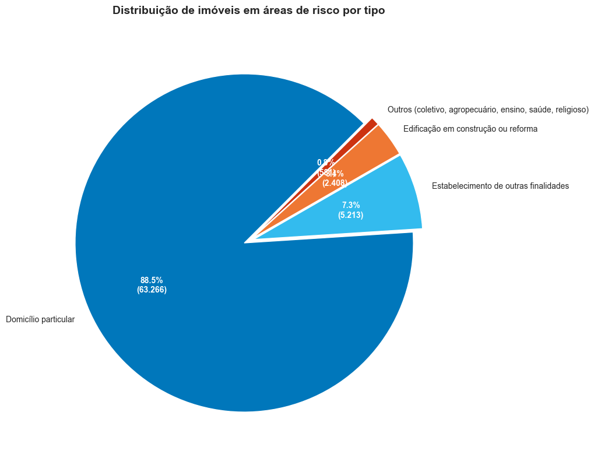
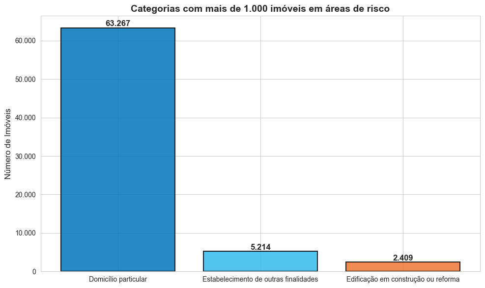
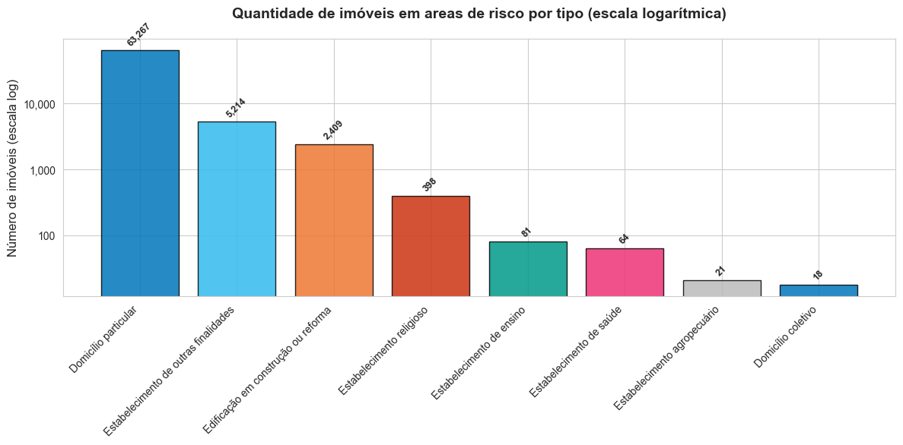

# Catálogo dos imóveis em áreas de risco

### Introdução

Após mapear as [áreas de risco](https://github.com/guiajf/riscojf) e realizar uma [análise quantitativa](https://github.com/guiajf/domicilios) dos domicílios afetados, agora efetuamos o levantamento do endereço completo dos imóveis situados nessas regiões, com base nos dados do **Censo 2022.**

A seguir, demonstramos como as ferramentas de análise geoespacial podem auxiliar o poder públicao na gestão cadastral das famílias afetadas pelas chuvas, que têm direito a benefícios sociais em decorrência da situação, conforme reportagem do [Tribuna de Minas](https://tribunademinas.com.br/noticias/cidade/12-03-2026/beneficios-pjf-chuvas.html).

### Objetivo

Este projeto visa identificar de forma individualizada os imóveis situados em áreas de risco, de acordo com o mapa fornecido pela *Subsecretaria de Proteção e Defesa Civil* de Juiz de Fora e dados do **Censo 2022**, para subsidiar ações de controle durante a concessão de benefícios aos atingidos pelas enchentes e deslizamentos provocados pelas chuvas de fevereiro de 2026.

### Passo a passo:

1. Importamos as bibliotecas necessárias.
2. Listamos as áreas de risco.
3. Carregamos os dados do **Censo 2022**.
3. Identificamos os imóveis situados nas áreas de risco.
4. Extraímos os endereços completos.
5. Preparamos os dados para exportação.
6. Salvamos o arquivo *csv*.

### Bibliotecas

Carregamos as seguintes bibliotecas:

- **pandas:** biblioteca fundamental para análise de dados em Python, oferece estruturas como DataFrame e Series para manipulação e análise de dados tabulares;
- **numpy:** pacote essencial para computação científica, fornece suporte a arrays multidimensionais e funções matemáticas de alto desempenho;
- **geopandas:** extensão do pandas que facilita o trabalho com dados geoespaciais, permitindo operações geométricas e projeções cartográficas em estruturas de DataFrame;
- **zipfile:** módulo da biblioteca padrão para criação, leitura e extração de arquivos ZIP;
- **Point (shapely.geometry):** classe da biblioteca shapely para representação e manipulação de pontos geométricos, fundamental para operações geoespaciais;
- **os:** módulo da biblioteca padrão que fornece interface para funcionalidades do sistema operacional, como manipulação de arquivos e diretórios;
- **fiona:** biblioteca para leitura e escrita de dados geoespaciais em diversos formatos, atuando como camada de abstração sobre o OGR;
- **matplotlib.pyplot:** biblioteca fundamental para visualização de dados em Python, fornece interface estilo MATLAB para criação de gráficos estáticos, permitindo controle preciso sobre figuras, eixos, cores e anotações;
- **seaborn:** biblioteca de visualização estatística baseada no matplotlib, oferece interface de alto nível para criação de gráficos atrativos com suporte nativo a DataFrames do pandas, paletas acessíveis e funções especializadas para análise exploratória.


```python
import pandas as pd
import numpy as np
import geopandas as gpd
import zipfile
from shapely.geometry import Point
import os
import fiona

import matplotlib.pyplot as plt
import seaborn as sns

import locale
```

### Carregamos as áreas de risco


```python
print("Carregando áreas de risco...")
camadas = fiona.listlayers("mapa_risco_jf.kml")
gdfs = []
for layer in camadas:
    gdf = gpd.read_file("mapa_risco_jf.kml", layer=layer)
    gdf['camada_origem'] = layer
    gdfs.append(gdf)
gdf_risco_original = pd.concat(gdfs, ignore_index=True)

# Manter apenas polígonos
gdf_risco_pol = gdf_risco_original[
    gdf_risco_original.geometry.geom_type.isin(['Polygon', 'MultiPolygon'])
].copy()
print(f"Polígonos de risco carregados: {len(gdf_risco_pol)}")
```

    Carregando áreas de risco...
    Polígonos de risco carregados: 1162


### Carregamos os dados do Censo 2022


```python
print("\nCarregando dados do CNEFE...")

with zipfile.ZipFile('domicilios_jf.zip') as z:
    with z.open('3136702_JUIZ_DE_FORA.csv') as f:
        # Definir tipos específicos para as colunas
        dtype_spec = {
            'NOM_COMP_ELEM1': str,
            'VAL_COMP_ELEM1': str,
            'NOM_COMP_ELEM2': str,
            'VAL_COMP_ELEM2': str,
            'NOM_COMP_ELEM3': str,
            'VAL_COMP_ELEM3': str,
            'NOM_COMP_ELEM4': str,
            'VAL_COMP_ELEM4': str,
            'NOM_COMP_ELEM5': str,
            'VAL_COMP_ELEM5': str
        }
        
        df = pd.read_csv(f, sep=';', encoding='latin1', dtype=dtype_spec)

print(f"Total de registros no CNEFE: {len(df):,}")

# Filtrar apenas imóveis com coordenadas válidas
df_coords = df.dropna(subset=['LATITUDE', 'LONGITUDE'])
df_coords = df_coords[(df_coords['LATITUDE'] != 0) & (df_coords['LONGITUDE'] != 0)]
print(f"Registros com coordenadas válidas: {len(df_coords):,}")

# Criar GeoDataFrame
geometry = [Point(xy) for xy in zip(df_coords['LONGITUDE'], df_coords['LATITUDE'])]
gdf_domicilios = gpd.GeoDataFrame(df_coords, geometry=geometry, crs="EPSG:4326")
```

    
    Carregando dados do CNEFE...
    Total de registros no CNEFE: 307,905
    Registros com coordenadas válidas: 307,905


### Identificamos os imóveis situados em áreas de risco


```python
print("\nIdentificando imóveis em áreas de risco...")

# Converter para UTM (projeção adequada para Juiz de Fora)
gdf_domicilios_utm = gdf_domicilios.to_crs(epsg=31983)
gdf_risco_utm = gdf_risco_pol.to_crs(epsg=31983)

# Spatial join para encontrar imóveis dentro dos polígonos de risco
domicilios_risco = gpd.sjoin(
    gdf_domicilios_utm,
    gdf_risco_utm[['geometry', 'camada_origem']],
    how='inner',
    predicate='within'
)

print(f"Imóveis em áreas de risco: {len(domicilios_risco)}")

```

    
    Identificando imóveis em áreas de risco...
    Imóveis em áreas de risco: 71472


### Extraísmos os endereços completos


```python
def construir_endereco(row):
    """
    Constrói o endereço completo a partir das colunas do CNEFE,
    conforme dicionário de dados fornecido.
    """
    # Partes principais do endereço
    tipo_log = str(row.get('NOM_TIPO_SEGLOGR', '')).strip() if pd.notna(row.get('NOM_TIPO_SEGLOGR')) else ''
    titulo_log = str(row.get('NOM_TITULO_SEGLOGR', '')).strip() if pd.notna(row.get('NOM_TITULO_SEGLOGR')) else ''
    nome_log = str(row.get('NOM_SEGLOGR', '')).strip() if pd.notna(row.get('NOM_SEGLOGR')) else ''
    numero = str(row.get('NUM_ENDERECO', '')).strip() if pd.notna(row.get('NUM_ENDERECO')) else 's/n'
    modificador = str(row.get('DSC_MODIFICADOR', '')).strip() if pd.notna(row.get('DSC_MODIFICADOR')) else ''
    
    # Montar nome do logradouro
    partes_log = [p for p in [tipo_log, titulo_log, nome_log] if p]
    logradouro = ' '.join(partes_log) if partes_log else 'Logradouro não informado'
    
    # Número com modificador
    if modificador:
        numero_completo = f"{numero} {modificador}"
    else:
        numero_completo = numero
    
    # Complementos (até 5 elementos possíveis)
    complementos = []
    for i in range(1, 6):
        nom_comp = row.get(f'NOM_COMP_ELEM{i}', '')
        val_comp = row.get(f'VAL_COMP_ELEM{i}', '')
        if pd.notna(nom_comp) and pd.notna(val_comp) and str(nom_comp).strip() and str(val_comp).strip():
            complementos.append(f"{nom_comp}: {val_comp}")
    
    complemento_str = ' | '.join(complementos) if complementos else ''
    
    # Localidade e CEP
    localidade = str(row.get('DSC_LOCALIDADE', '')).strip() if pd.notna(row.get('DSC_LOCALIDADE')) else ''
    cep = str(row.get('CEP', '')).strip() if pd.notna(row.get('CEP')) else ''
    if len(cep) == 8:
        cep_formatado = f"{cep[:5]}-{cep[5:]}"
    else:
        cep_formatado = cep
    
    # Montar endereço completo
    endereco_parts = [logradouro, numero_completo]
    if complemento_str:
        endereco_parts.append(complemento_str)
    endereco_parts.append(localidade) if localidade else None
    endereco_parts.append(f"CEP: {cep_formatado}") if cep_formatado else None
    
    return ', '.join([p for p in endereco_parts if p])

# Aplicar a função para criar coluna de endereço completo
domicilios_risco['ENDERECO_COMPLETO'] = domicilios_risco.apply(construir_endereco, axis=1)

```

### Preparamos os dados para exportação


```python
# Colunas a serem exportadas (endereço + informações de localização + risco)
colunas_exportar = [
    'ENDERECO_COMPLETO',
    'CEP',
    'DSC_LOCALIDADE',
    'NOM_TIPO_SEGLOGR',
    'NOM_TITULO_SEGLOGR',
    'NOM_SEGLOGR',
    'NUM_ENDERECO',
    'DSC_MODIFICADOR',
    'LATITUDE',
    'LONGITUDE',
    'camada_origem',  # Tipo de risco (Geológico ou Hidrológico)
    'COD_ESPECIE'     # Tipo de imóvel (domicílio, estabelecimento, etc.)
]

# Verificar quais colunas realmente existem no DataFrame
colunas_existentes = [col for col in colunas_exportar if col in domicilios_risco.columns]
df_export = domicilios_risco[colunas_existentes].copy()

# Mapear COD_ESPECIE para descrição legível
especie_desc = {
    1: 'Domicílio particular',
    2: 'Domicílio coletivo',
    3: 'Estabelecimento agropecuário',
    4: 'Estabelecimento de ensino',
    5: 'Estabelecimento de saúde',
    6: 'Estabelecimento de outras finalidades',
    7: 'Edificação em construção ou reforma',
    8: 'Estabelecimento religioso'
}
df_export['TIPO_IMOVEL'] = df_export['COD_ESPECIE'].map(especie_desc)

```

### Salvamos em arquivo texto


```python
output_file = 'enderecos_imoveis_areas_risco_jf.csv'
df_export.to_csv(output_file, index=False, encoding='utf-8-sig')
```

### Visualizamos a distribuição dos imóveis


```python
# ============================================
# CONFIGURAÇÕES INICIAIS
# ============================================

# Paletas acessíveis para daltonismo (colorblind-friendly)
# Opção 1: Paul Tol's "Vibrant" palette (recomendada)
CORES_ACESSIVEIS = ['#0077BB', '#33BBEE', '#EE7733', '#CC3311', '#009988', '#EE3377', '#BBBBBB']

# Opção 2: Seaborn colorblind palette (já acessível)
# from seaborn import color_palette
# CORES_ACESSIVEIS = sns.color_palette("colorblind", 8)

# Opção 3: CUD (Color Universal Design) - 8 cores seguras
# CORES_ACESSIVEIS = ['#000000', '#E69F00', '#56B4E9', '#009E73', '#F0E442', '#0072B2', '#D55E00', '#CC79A7']

# Configurar estilo
plt.style.use('default')
sns.set_style("whitegrid")

# Configurar fontes
plt.rcParams['font.size'] = 11
plt.rcParams['axes.titlesize'] = 14
plt.rcParams['axes.labelsize'] = 12
plt.rcParams['xtick.labelsize'] = 10
plt.rcParams['ytick.labelsize'] = 10

# Configurações para formato brasileiro
pd.options.display.float_format = '{:.2f}'.format

def formatar_numero_br(valor):
    """Formata número inteiro no padrão brasileiro (63.267)"""
    return f"{int(valor):,}".replace(",", ".")

def formatar_percentual_br(valor):
    """Formata percentual no padrão brasileiro (88,52%)"""
    return f"{valor:.2f}".replace(".", ",") + "%"

# Tentar configurar locale para formatação de eixos
try:
    locale.setlocale(locale.LC_ALL, 'pt_BR.UTF-8')
    usar_locale = True
except:
    usar_locale = False
    def formatador_eixo_br(x, p):
        return f"{int(x):,}".replace(",", ".")


# ============================================
# DATAFRAME COM OS DADOS REAIS
# ============================================

contagem_especie = df_export['COD_ESPECIE'].value_counts().reset_index()
contagem_especie.columns = ['COD_ESPECIE', 'QUANTIDADE']

# Adicionar descrição
contagem_especie['DESCRICAO'] = contagem_especie['COD_ESPECIE'].map(especie_desc)

# Ordenar por quantidade
contagem_especie = contagem_especie.sort_values('QUANTIDADE', ascending=False).reset_index(drop=True)

# Calcular percentual
total = contagem_especie['QUANTIDADE'].sum()
contagem_especie['PERCENTUAL'] = (contagem_especie['QUANTIDADE'] / total) * 100

print("="*80)
print("DADOS PARA VISUALIZAÇÃO")
print("="*80)
print(f"{'Tipo de Imóvel':<45} {'Quantidade':>12} {'Percentual':>10}")
print("-"*80)

for _, row in contagem_especie.iterrows():
    # Aplicar formatação apenas na impressão
    quantidade_fmt = formatar_numero_br(row['QUANTIDADE'])
    percentual_fmt = formatar_percentual_br(row['PERCENTUAL'])
    print(f"{row['DESCRICAO']:<45} {quantidade_fmt:>12} {percentual_fmt:>10}")

print("-"*80)
print(f"{'TOTAL':<45} {formatar_numero_br(total):>12} {'100,00%':>10}")
print("="*80)


# ============================================
# GRÁFICO 4: Pizza com percentuais formatados
# ============================================

# Agrupar categorias pequenas
categorias_pequenas = contagem_especie[contagem_especie['PERCENTUAL'] < 1]
categorias_principais_pizza = contagem_especie[contagem_especie['PERCENTUAL'] >= 1]

if len(categorias_pequenas) > 0:
    outros = pd.DataFrame({
        'DESCRICAO': ['Outros (coletivo, agropecuário, ensino, saúde, religioso)'],
        'QUANTIDADE': [categorias_pequenas['QUANTIDADE'].sum()],
        'PERCENTUAL': [categorias_pequenas['PERCENTUAL'].sum()]
    })
    dados_pizza = pd.concat([categorias_principais_pizza, outros], ignore_index=True)
else:
    dados_pizza = contagem_especie.copy()

fig4, ax4 = plt.subplots(figsize=(10, 8))

cores_pizza = CORES_ACESSIVEIS[:len(dados_pizza)]

# Função para formatar percentual no autopct
def autopct_format(pct):
    valor = pct / 100 * total
    return f'{pct:.1f}%\n({formatar_numero_br(valor)})'

wedges, texts, autotexts = ax4.pie(
    dados_pizza['QUANTIDADE'],
    labels=dados_pizza['DESCRICAO'],
    autopct=autopct_format,  # Usa formatação brasileira
    colors=cores_pizza,
    startangle=45,
    explode=[0.03] * len(dados_pizza),
    textprops={'fontsize': 10}
)

for autotext in autotexts:
    autotext.set_color('white')
    autotext.set_fontweight('bold')
    autotext.set_fontsize(10)

for text in texts:
    text.set_fontsize(10)

ax4.set_title('Distribuição de imóveis em áreas de risco por tipo', fontsize=14, fontweight='bold', pad=20)

plt.tight_layout()
plt.show()


# ============================================
# GRÁFICO 2: Categorias com mais de 1000 imóveis 
# ============================================

categorias_principais = contagem_especie[contagem_especie['QUANTIDADE'] > 1000].copy()

if len(categorias_principais) > 0:
    fig3, ax3 = plt.subplots(figsize=(10, 6))
    
    cores_graf3 = CORES_ACESSIVEIS[:len(categorias_principais)]
    
    bars_p = ax3.bar(
        categorias_principais['DESCRICAO'],
        categorias_principais['QUANTIDADE'],
        color=cores_graf3,
        edgecolor='black',
        linewidth=1.5,
        alpha=0.85
    )
    
    # Adicionar valores formatados
    for bar, valor in zip(bars_p, categorias_principais['QUANTIDADE']):
        ax3.text(
            bar.get_x() + bar.get_width() / 2,
            bar.get_height() + 100,
            formatar_numero_br(valor),  # Formatação na saída
            ha='center',
            va='bottom',
            fontsize=12,
            fontweight='bold'
        )
    
    if usar_locale:
        ax3.yaxis.set_major_formatter(plt.FuncFormatter(lambda x, p: locale.format_string("%d", x, grouping=True)))
    else:
        ax3.yaxis.set_major_formatter(plt.FuncFormatter(formatador_eixo_br))
    
    ax3.set_title('Categorias com mais de 1.000 imóveis em áreas de risco', 
                  fontsize=14, fontweight='bold')
    ax3.set_xlabel('')
    ax3.set_ylabel('Número de Imóveis', fontsize=12)
    
    plt.xticks(rotation=0)
    plt.tight_layout()
    plt.show()

# ============================================
# GRÁFICO 3: Escala logarítmica 
# ============================================

fig6, ax6 = plt.subplots(figsize=(12, 6))

cores_graf6 = CORES_ACESSIVEIS[:len(contagem_especie)]

bars_log = ax6.bar(
    contagem_especie['DESCRICAO'],
    contagem_especie['QUANTIDADE'],
    color=cores_graf6,
    edgecolor='black',
    linewidth=1,
    alpha=0.85
)

for bar, valor in zip(bars_log, contagem_especie['QUANTIDADE']):
    ax6.text(
        bar.get_x() + bar.get_width() / 2,
        bar.get_height() * 1.1,
        f'{valor:,.0f}',
        ha='center',
        va='bottom',
        fontsize=9,
        fontweight='bold',
        rotation=45
    )

ax6.set_yscale('log')
ax6.yaxis.set_major_formatter(plt.FuncFormatter(lambda x, p: f'{int(x):,}'))
ax6.set_title('Quantidade de imóveis em areas de risco por tipo (escala logarítmica)', 
              fontsize=14, fontweight='bold', pad=20)
ax6.set_xlabel('')
ax6.set_ylabel('Número de imóveis (escala log)', fontsize=12)
plt.xticks(rotation=45, ha='right')

plt.tight_layout()
plt.show()

```

    ================================================================================
    DADOS PARA VISUALIZAÇÃO
    ================================================================================
    Tipo de Imóvel                                  Quantidade Percentual
    --------------------------------------------------------------------------------
    Domicílio particular                                63.267     88,52%
    Estabelecimento de outras finalidades                5.214      7,30%
    Edificação em construção ou reforma                  2.409      3,37%
    Estabelecimento religioso                              398      0,56%
    Estabelecimento de ensino                               81      0,11%
    Estabelecimento de saúde                                64      0,09%
    Estabelecimento agropecuário                            21      0,03%
    Domicílio coletivo                                      18      0,03%
    --------------------------------------------------------------------------------
    TOTAL                                               71.472    100,00%
    ================================================================================


    

    


    

    


    

    


**Considerações finais:**

O poder discriminatório do código pode ser ampliado com ferramentas complementares para preencher lacunas temporais e espaciais, considerando eventos como: lapso entre levantamentos, novas construções, mobilidade social e outras alterações na estrutura do território.

Como resultado adicional, visualizamos a distribuição dos imóveis por espécie.
